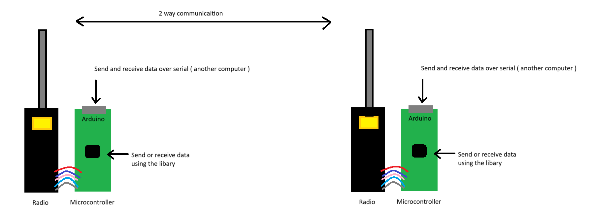

# nrf24l01+pa+lna radio code

This code provides nrf24l01+pa+lna to transfer key-value pairs over 2 radios.
 
Data can be sent and received either through the library or via the serial port.

## Repos
This repo is part of a larger rover project found below

Server:
  https://github.com/OliverP10/FSTelemetryServer

Webapp:
  https://github.com/OliverP10/FSTelemetryDisplay
  
Radio:
  https://github.com/OliverP10/transceiver-primary
  https://github.com/OliverP10/transceiver-secondary

Rover:
  https://github.com/OliverP10/Rover

## Videos
Playlist:
  https://www.youtube.com/playlist?list=PL5_VVY8SCjjyPs3t0taw3Mroj-2t5A2T2

Demo:
  

Features:
  

Real rover:
  
